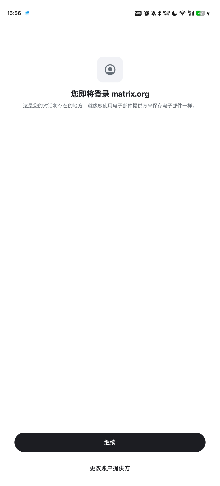
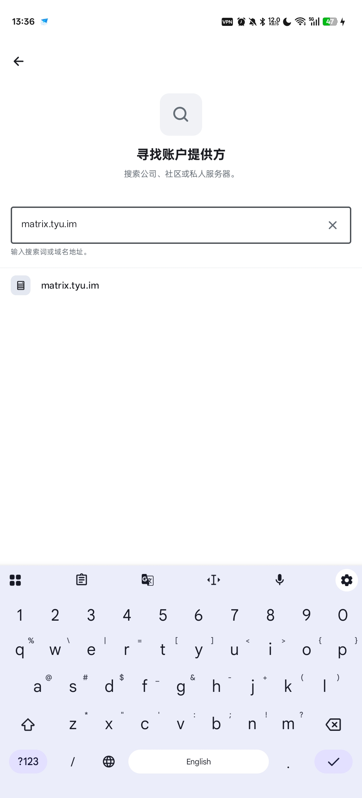
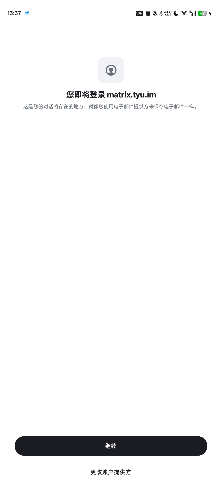
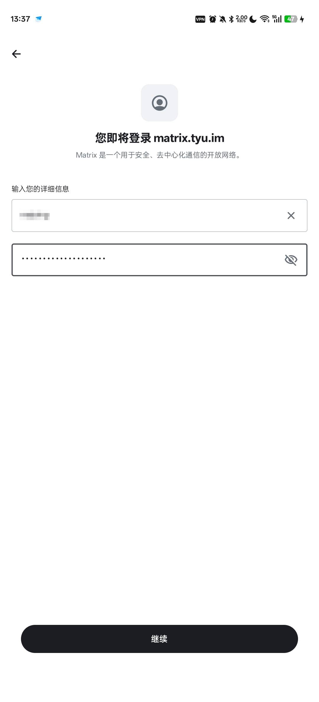
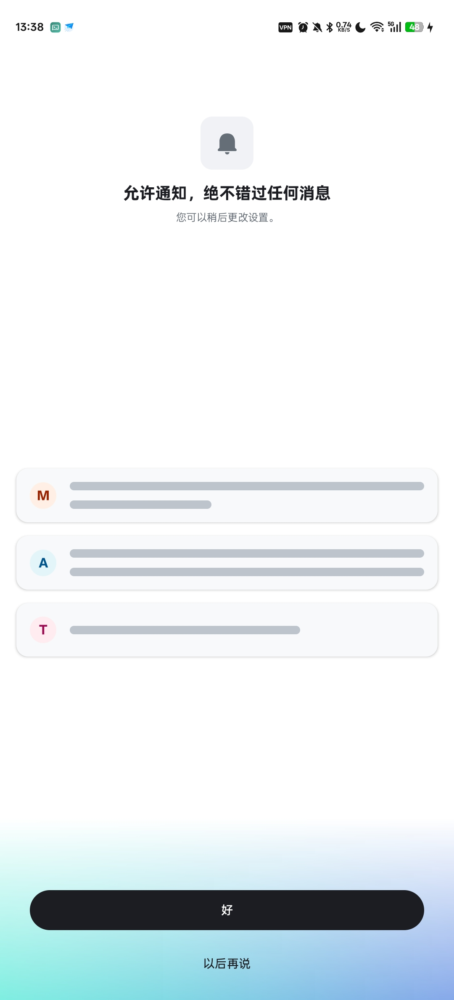
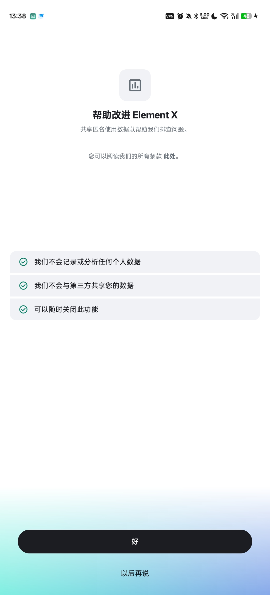

# 第一次使用Element X

## 首先准备账户名和密码 私聊发送给奶瓶

可以联系[jtp0415@outlook.com](mailto:jtp0415@outlook.com)

**不接受App内注册**

## 下载地址

[Google Play下载](https://play.google.com/store/apps/details?id=io.element.android.x&hl=zh_cn)

需要梯子

> 以下已废弃:
>
> [Github来源](https://github.com/element-hq/element-x-android/releases/download/v25.12.0/app-fdroid-arm64-v8a-release-signed.apk)
> 
> [F-droid来源](https://f-droid.org/repo/io.element.android.x_202512002.apk)
> 
> [代理Github来源](https://p.tyu.im/github.com/element-hq/element-x-android/releases/download/v25.12.0/app-fdroid-arm64-v8a-release-signed.apk)
> 
> [代理F-droid来源](https://p.tyu.im/f-droid.org/repo/io.element.android.x_202512002.apk)
> 
> 上面两个需要使用梯子下载，下面两个不需要
> 
> 下载的内容没有区别，随意选择下载即可

## 下载完成打开Element X 选择手动登陆

## 选择更改账户提供方 *不是高亮的按钮*

## 选择其他

## 输入`https://matrix.tyu.im`

等待片刻 下面会显示`matrix.tyu.im` 点击显示出来的`matrix.tyu.im`

::: tip
如果这一步下面无法显示 检查网络连接（不需要梯子）

如果还是不显示 联系奶瓶 可能是服务器宕机了
:::

## 继续

## 输入账户名和密码

## 第一次登陆选择无法确认

## 允许通知

## 帮助改进 我选择的是参与

## 如果需要多设备登陆 点击设置恢复

如果只有一个设备可以忽略

## 设置恢复

## 生成恢复密钥

## 复制恢复密钥 或者保存到本地

::: danger
恢复密钥非常重要，别人获得恢复密钥可以登陆你的账户

多设备登陆也需要恢复密钥

如果丢失可以在这里重新生成
:::

## 备注

::: tip
有任何问题可以联系奶瓶，比如多设备登陆或者恢复聊天记录
:::

<!--  -->
<!--  -->

