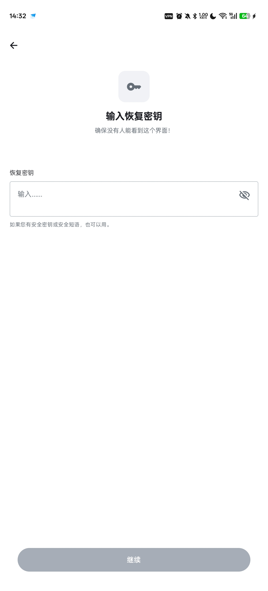
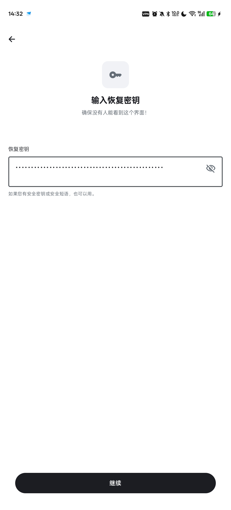

# 多设备登陆Element X

## 多设备登陆

如果手边有另一个已经登陆的设备，选择`使用其他设备`，按照提示方便快捷

如果没有，点击`输入恢复密钥`

## 输入第一次登陆时保存的恢复密钥

## 点击继续

如果恢复密钥正确，这样就可以继续使用了

如果密钥不对，请输入正确的密钥

## 备注

::: warning
没有通过验证的设备可以登陆，但是收到加密信息但是无法解密，但是可以发送不加密的信息

强烈建议使用加密信息，保证只有拥有恢复密钥的人才能解密信息
:::
