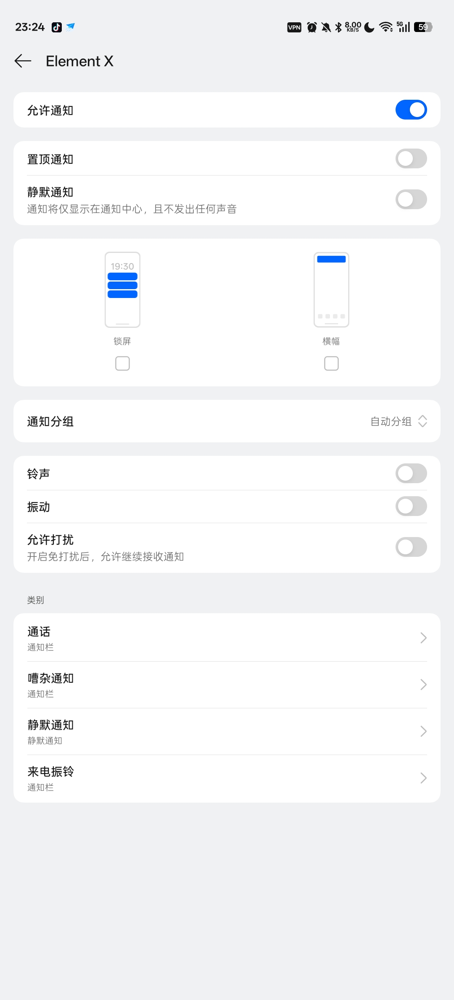
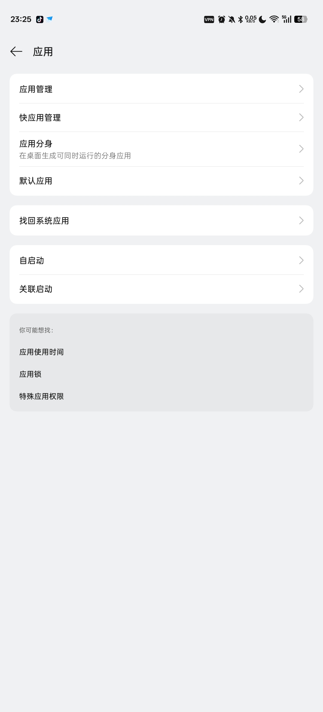

# Element X 疑难杂症

## 进入App详细信息，点击耗电管理

## 完全允许后台行为

作为即时聊天软件，必须保持后台运行

## App详细信息，点击通知管理，允许通知

## 在设置里搜索自启动选项

::: tip
自启动选项不在App详细信息里面，要在设置里面搜索
:::

## 允许Element X自启动

## 备注

::: tip
Q: 为什么买来的国产手机不需要手动设置自启动？

A: 国产手机厂商有开机自启动白名单，例如 QQ 微信 默认开机自启动
:::