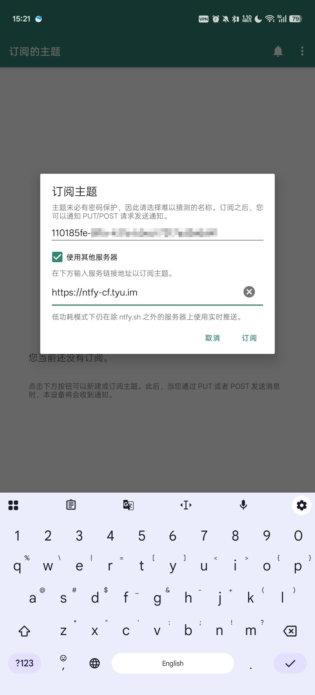
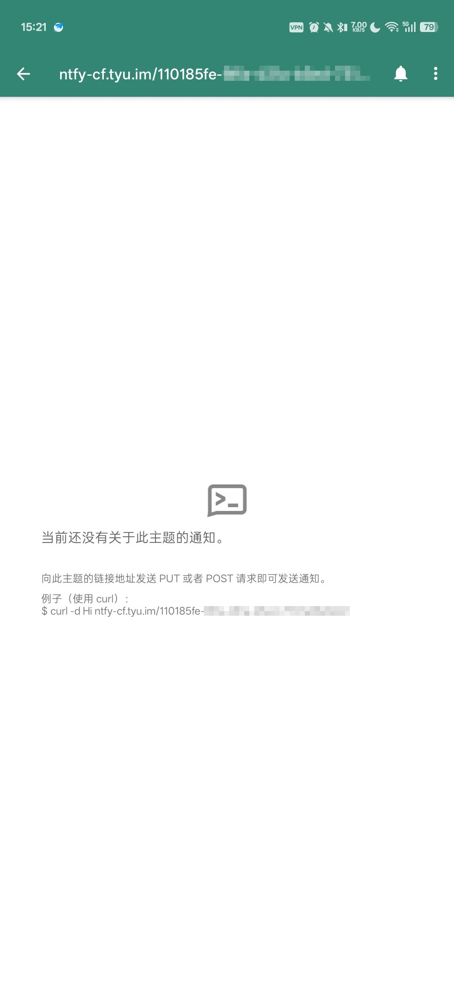
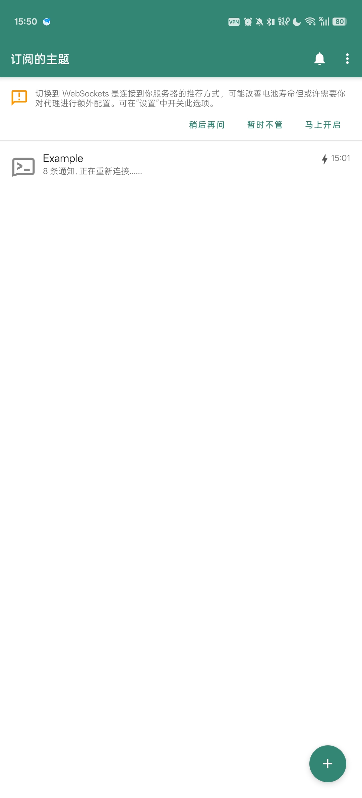

# Ntfy 订阅

[使用Google Play下载](https://play.google.com/store/apps/details?id=io.heckel.ntfy)

[使用F-droid下载](https://f-droid.org/repo/io.heckel.ntfy_47.apk)

[代理使用F-droid下载](https://p.tyu.im/f-droid.org/repo/io.heckel.ntfy_47.apk)

## 点开 Ntfy

## 输入订阅的Id和域名

一般来说 我会提供类似于`https://ntfy-cf.tyu.im/110185fe-0000-0000-0000-000000000000`

这里的`110185fe-0000-0000-0000-000000000000`就是Id

`https://ntfy-cf.tyu.im`就是域名

域名如果使用过可以点击右边小三角

如果没有使用过需要完整输入 不能省略`https://`

## 订阅成功

## 点右上角三个点

## 点订阅设置

## 点显示名 这里可以修改显示名字

::: tip
也可以修改Logo
:::

::: warning
注意在设置中允许开机自启动，允许消息提示，关掉后台电量限制
:::

## 使用 Websocket

::: warning
**重要**: 询问是否使用Websocket 一定要选择`马上开启`
:::

::: details
`https://ntfy-cf.tyu.im` 只实现了Websocket Endpoint，没有实现HTTP Endpoint
:::

